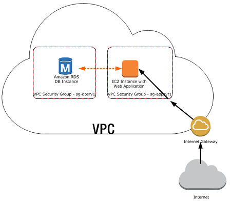

A garment store called HackerStyle has found overnight success. Now people are flocking to its online e-commerce portal. The traffic has increased by 50X, and the company founders want the development team to capitalize on the traffic. 

The System is using only a `EC2` instance type `t2-medium` with a public IP and a RDS Mysql `db.m4.large`

Advice on improving overall system availability and reliablity through some best practices that applies to this infrastructure.

